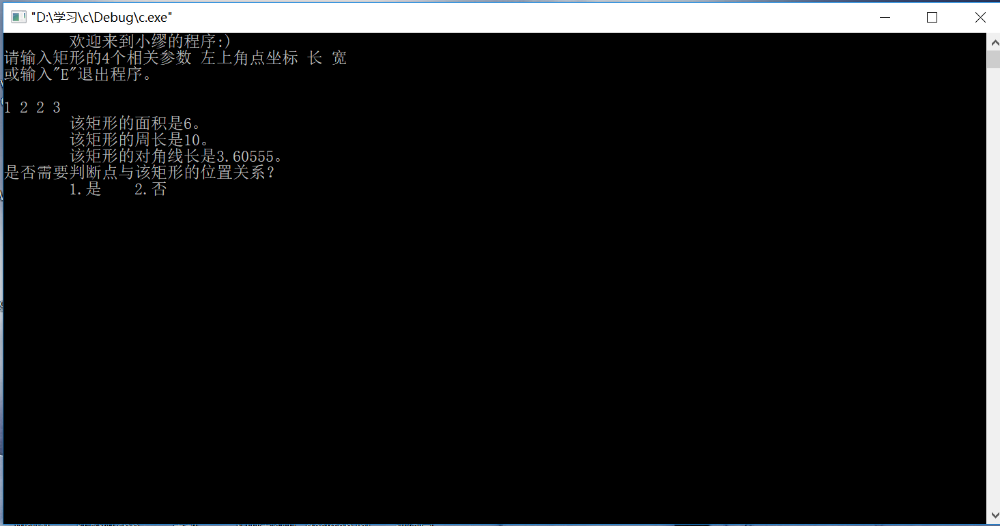

# 通过c++进行矩形参数的计算
## 关于程序
这是一个计算矩形相关参数的c++小程序。

    输入矩形左上顶点左边及矩形的长和宽，可以得出矩形的面积、体积和对角线长度。  
    接下来可以继续判断某点与矩形的位置关系，包括“位于矩形内部（不包括边界）。”“位于矩形外。”和“位于矩形边界上。”三种情况。
## 如何使用
+ 在c++编译器中打开文件
+ 开始运行  

+ 根据提示输入矩形基本参数，单击"enter"键可得矩形相应参数

+ 根据提示继续进行，可判断点位置与矩形关系
